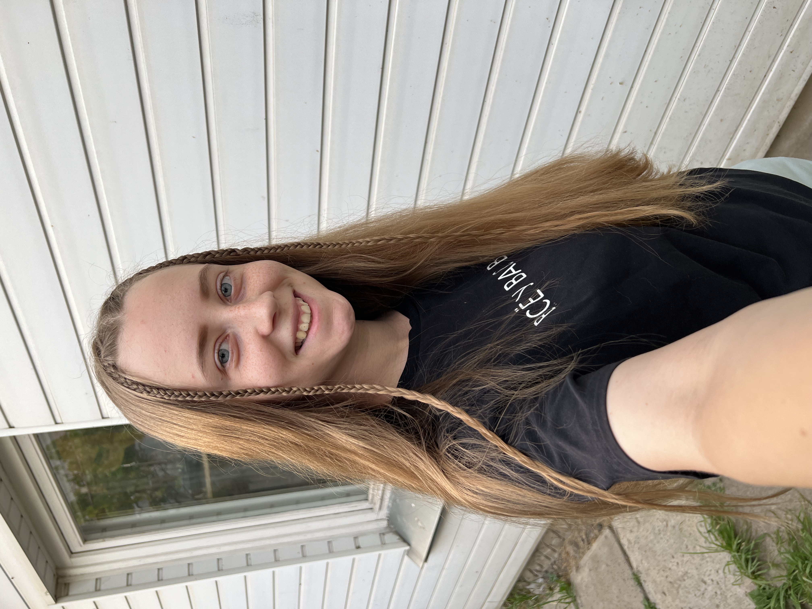

# Анастасия Беднова

## Контактная информация
- GitHub: [github.com/abednova](https://github.com/abednova)

## Образование
- 2016-2020: БГПУ им. М. Танка, Институт Инклюзивного Образования, специальность "Тифлопедагогика"
- 2020-2021: БГПУ им. М. Танка, Институт Инклюзивного Образования, магистратура "Специальное образование"

## Опыт работы
- 2018-2024: SMM

## Ключевые навыки
- HTML
- CSS
- JavaScript

## О себе
- Увлекаюсь танцами
- Люблю активный образ жизни
- Хочу стать фронтенд-разработчиком

## Почему я хочу стать разработчиком
- Хочу развиваться в IT-сфере
- Хочу работать удаленно
- Хочу иметь возможность путешествовать

## Ожидания от курса
- Научиться создавать сайты
- Найти работу мечты    

